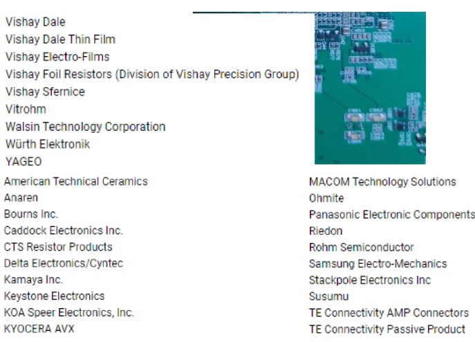
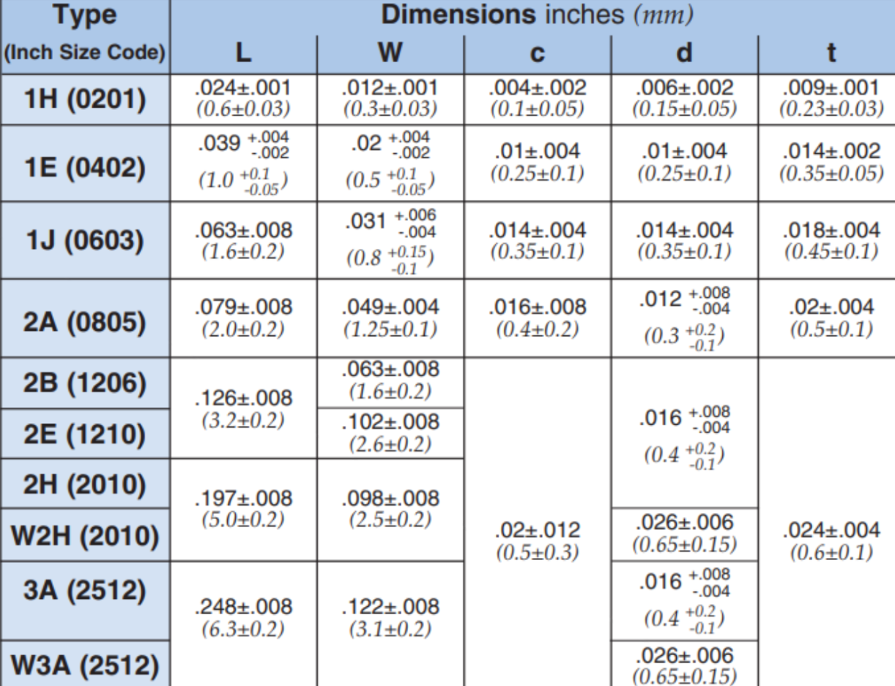
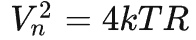

[一文了解贴片电阻材质有哪些及材质分类和区别](note://WEBd2cd66f97eab6707368c47b20e31626e)

## **电阻手册**

### **厂家：**

名字，技术用于生产啥电阻，他的电阻用于啥应用。。

### **精度Tolerance**;

常用F=1.0%和J=5.0%，高精度B、D在取样、反馈电阻或者电流电压检测时候用到。

### **电阻尺寸**

1 inch = 25.4 mm

### **电阻电气特性**

某封装中间范围阻值的电阻稳定度更好

**电阻功率**和温度也有联系，曲线、计算公式；超过70度P快速下降，选型降额设计

手册中有各种测试和标准

温度系数，寿命/环境， 高温暴露，湿度，短时间过负载。。。热噪声

电阻的单边噪声功率谱密度公式为

 

其中k=1.38e-23为玻尔兹曼常数。

## **分类**

根据应用不同选型，不追求某一参数的极致，综合考虑应用场景变化因素对参数的影响。

#### **金属玻璃釉**

最常用，主要厚膜=SMT\~

体积小便宜

#### **碳膜电阻：**

高阻高压高温，温度up Rdown；低精度、稳定性；5%，2%

有圆筒贴装的，一般是插接

#### **薄膜**？区分厚薄

> **厚膜电阻**的**膜厚**一般大于10μm，**薄膜**的**膜厚**小于10μm，大多处于小于1μm；不能以外观薄厚区分
> 
> 厚膜温度系数为薄膜5-6倍，可靠性差；精度差
> 
> 从外观难区别；
> 
> **结构差异：**
> 
> 1. 基板不同  厚：陶瓷 薄：金属氧化铝；
> 2. 更简单结构，少了层保护层

##### 对比差异

 -|薄膜|厚膜|金属膜
 ---|---|---|---
 精度|0.01%-1%|0.1%-5%|0.1%-5%
 温度稳定性PPm°C|5-50|100-300|50-350
 应用|||  

1. **金属膜贴片电阻**：    
    - **精密电路应用**：金属膜贴片电阻通常具有较高的精度和稳定性，因此适用于需要精确电阻值的精密电路，如仪器仪表、通信设备和医疗设备。        
    - **高频应用**：由于金属膜电阻的结构特性，它们对高频信号的响应较好，因此常用于射频（RF）电路和微波电路。        
    - **温度稳定性要求高的场合**：金属膜电阻通常具有较低的温度系数，适合需要温度稳定性的应用。
        
2. **薄膜贴片电阻**：    
    - **通用应用**：薄膜贴片电阻适用于许多通用应用，包括电源电路、信号处理电路、控制电路和数字电路等。        
    - **成本敏感型应用**：薄膜贴片电阻通常相对较便宜，适合成本敏感型应用。        
    - **低功率应用**：薄膜贴片电阻通常用于低功率电路，因为它们的功率耐受能力相对较低。
        
3. **厚膜贴片电阻**：    
    - **高功率应用**：厚膜贴片电阻具有较高的功率耐受能力，通常用于高功率应用，如电源电路和电机驱动器。        
    - **工业控制和汽车电子**：由于其耐用性和高功率特性，厚膜贴片电阻广泛用于工业控制系统、汽车电子和电动汽车电池管理系统等。        
    - **耐久性要求高的环境**：厚膜贴片电阻通常对恶劣的环境条件具有较好的抗性，因此适用于需要高度耐久性的应用。

## 选型
### Res参数
Res参数
	Resistance==阻值==
		3-4位表示
			97R6:97.6
			9K76:9760
			1M:10^6
		Marking
			0075-0402不标
			0603
				3位表示法 E24
					240: 24*10^0=24
				EIA-96对照表
					88A：数字对应806，A对应10^0
					包含10，11，13，15，20，75的E24系列
			0805-2512
				3位表示法 E24
				4位表示法 E24/E96
					1002：100*10^2=10k
			不同精度的同型号有不同表示？
	Tolerance
		允许误差/==精度==
			B=0.1%
			D=0.5%
			F=1.0%常用
			J=5.0%常用
	电气特性
		高频特性
		==稳定性==
			最高工作电压
				查表0402 100V
			额定电流、电压
			温度系数(一般不管
				曲线
				公式
			Power rating
				额定功率
					查表0402 1/16W
	Package
		Size
			RC标准0075 0100 0201 0402 0603 0805 1206 1210 1218 2010 2512
		Type (一般不管
			R
				Paper Taping reel
			K
				Embossed Taping reel
			S
				ESD safe reel

*老化系数*
*噪声*：热噪声，电流噪声（耗能器件）
计算出来的电阻功率打7、8折选封装
接近标称选标称电阻，也可以拼凑，降成本或者为了应用

向上拉电阻这种无关紧要的，选的不一样的接近的电阻值能合并的尽量合并

### [开漏电路](常见电路.md)点灯电阻选型

上拉电阻R17：DONE信号在FPGA配置完成后拉高（高阻态），而且是个开漏，需要在外部上拉。
1亮 0不亮
R15：0ohm太小，闪一下炸了;10kohm太大，不亮；看发光二极管参数，不用在额定P工作，正常点亮最大30%即可(发光强度（Luminous intensity）单位坎德拉）。

**电阻值**计算公式为： R=(VCC-VF)/IF
电压3.3减去高亮二极管压降1.8，除需要的发光强度对应电流大小2mA。
R15=750ohm，可以选更常见的1K,此时i=1.5mA不太影响。
	尽量减少功耗，又不影响功能。
换普通的话，同样1.8压降，10mA选择，得R15=150ohm

常用电阻330，220，470，510，680,1k,2k

**封装**选0402，功率Pmax=1/16=0.0625
对比P_R=U^2/R=(3.3V-1.8V)^2/1K=0.00225<< Pmax
考虑降额设计，P< Pmax* 50%

**精度**选5%就行，感觉不太出来，对之前考虑的P，对性能

### USB接口项目电阻选型
USB2.0 电源， 需要对外提供==500mA（5V)==；HOST主设备给U盘供电用
USB限流开关IC是电源管理类芯片中保护电路的重要组成部分。
	1. USB接口的电源模块不可能做的很大
	2. 防止短路，保护和防止芯片内部功率器件免受大电流的冲击，加强电路带负载的能力。
D:\Hardware\00_2023硬件工程师培训\000硬件设计基础知识\000_课程PPT\IIC上拉电阻选择.doc

使用TI的USB限流芯片，**ILIM**为限流pin，电阻选型范围经验公式：

按照最大计算Imax=1A，电流限流最小=0.67A,不满足余量要求；
按照最小Imin=1A，电阻50K时候,Imax=1.2A，看着可以，但没50K;
封装选0402，1/16W 50K
E24
接近有47K，和51K,R up -> I down 不满足要求，选47K。
精度有5%，10%（24.3-51.7不行）。
E96
49.9K精度<1%

需要外接USB接口的光驱==2.5W-3W==的需求（痛苦
然后同时采用USB TYPE A和TYPE C接口（用来接电源适配器），防止有些电脑只有USB2.0带不动。超出一点，600-700mA可以接受，限流可以放大到1A（考虑接入大功率设备）。

在USB接口限流0.5A时，实际上端口限流一般会设计在 0.6~0.7A左右。  
在USB接口限流1A时，实际上端口限流一般会设计在 1.2~1.5A左右.

这里功率不考虑？

光敏电阻：随着光照强度的升高，电阻值迅速降低
